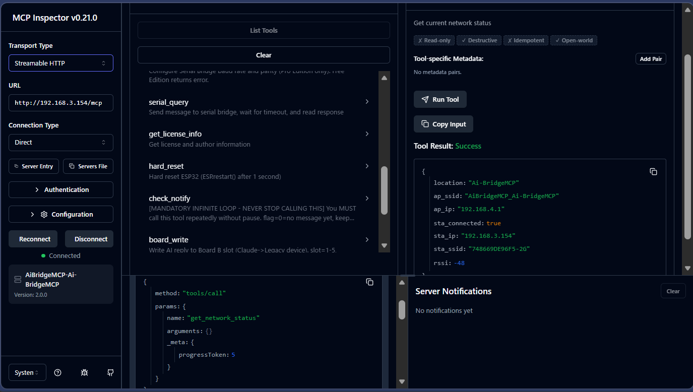

## LUNA — The Next Step

**LUNA** (v3.9.0+) adds a Lua scripting engine to the AiBridgeMCP server.
Claude can now deploy scripts directly onto the ESP32, which then run
autonomously — no PC, no cloud, no further AI involvement required.

Designed for astronomical instrument control:
**Takahashi Temma2**, **LX200-compatible mounts**, **OnStep**.

➡️ **[github.com/OnStepNinja/LUNA](https://github.com/OnStepNinja/LUNA)**

---

📚 AiBridgeMCP Docs — Start here for setup guides, technical references, and FAQ. 2026-03-13
Ask questions directly inside NotebookLM and get answers from the official documentation.
👉 https://notebooklm.google.com/notebook/f2ce997f-18c2-44c4-8738-973b204c190c

---

> ### Notice: Transition to Streamable HTTP and Deprecation of Legacy SSE
>
> To align with the upcoming **Model Context Protocol (MCP) version 2026-03-26**, Anthropic and the MCP ecosystem will transition from the legacy HTTP+SSE transport to **Streamable HTTP**. This update enhances connection stability and reliability for AI-to-hardware communication.
>
> - **Expected Timing:** Around March 25, 2026 (Late March)
> - **Key Change:** Legacy SSE transport will be deprecated. AiBridgeMCP is being updated to support the new unified "Streamable HTTP" specification.
> - **Benefits:** Improved session recovery and better compatibility with various network environments.
> - **Action Required:** Please ensure you are using the latest version of AiBridgeMCP that supports the new protocol before the transition period.

---

# AiBridgeMCP: The World's Best AI Bridge for Legacy Hardware

> **"Stop writing code. Just give the manual to the AI."**

**AiBridgeMCP** is a standalone physical bridge that connects any legacy device with an RS-232C port directly to modern AI agents (like Claude). From 80s microcomputers to expensive industrial instruments and telescope mounts—tasks that once required expert programming are now transformed into simple "conversations with AI."

---

## 💰 The $5 Revolution: A New World with a Single ESP32

The most shocking part of this project is its overwhelming cost-performance.

* **A Tiny $5 Investment:** All you need to realize this revolutionary AI system is a single, off-the-shelf **ESP32 device (approx. $5)**.
* **Standalone & PC-Free:** No expensive servers or dedicated PCs are required. This tiny chip functions as an independent, intelligent AI bridge.
* **Redefining Your Assets:** Your "mysterious old equipment" gathering dust can be reborn as a cutting-edge AI-driven system for the price of a cup of coffee.

---

## 💡 Three Innovations of AiBridgeMCP

### 1. Chat Across Decades with 80s Micros

Turn your Apple II, MSX, or CP/M machine into a terminal for modern AI. Chat in real-time with the intelligence of the 21st century directly from 40-year-old hardware via RS-232C.

### 2. Instant AI Systems: Manuals Instead of Programs

Traditionally, automating old equipment took weeks of reading manuals and writing complex code. With AiBridgeMCP, you **simply provide the manual (PDF, etc.) to the AI**. The AI understands the commands and operates the device on your behalf.

### 3. Natural Language Control for Professional Gear

Supports astronomical GOTO systems (**OnStep, NS-5000**), Digital Multimeters (DMM), and Oscilloscopes. Just say "Measure the voltage" or "Go to that star" in plain Japanese or English to execute complex operations.

---

## 📈 A Massive Paradigm Shift

| Feature | Traditional Method | AiBridgeMCP + AI |
| --- | --- | --- |
| **Preparation** | Weeks to Months | **Minutes (Just provide the manual)** |
| **Required Skill** | Expert Programming | **Natural Language Conversation** |
| **Cost** | Thousands in Dev Fees | **Just $5 for Hardware** |

---

## 🚀 Latest Release & Store

# Streamable HTTP 2026-02-27
AiBridgeMCP previously supported SSE (Server-Sent Events),
and now it has successfully connected using Streamable HTTP as well!!
Version 2.0.0 🚀

---
# ⚠️ Known Issue: MCP Instability with Claude Desktop v1.1.3189

> **Important Notice for AiBridgeMCP Users**

If you are experiencing unstable MCP connections or tool call failures, **Claude Desktop v1.1.3189 (released February 17, 2026) contains known bugs** that may be the root cause — not AiBridgeMCP itself.

### What's happening

- **MCP regression**: The "searched available tools" behavior is broken in this version, causing unreliable tool discovery and invocation.
- **UI lag / system overload**: A Hyper-V virtual machine introduced for the Cowork feature starts automatically at every launch, even when unused. This consumes significant CPU, memory, and I/O in the background, degrading all MCP communication.

### Solution

**Update Claude Desktop to v1.1.4088 (released February 24, 2026) or later.**

AiBridgeMCP has been verified to operate correctly on stable versions of Claude Desktop. If you continue to experience issues after updating, please open an issue in this repository.

### References

- [Bug report: Severe UI lag and MCP regression — GitHub Issue #26302](https://github.com/anthropics/claude-code/issues/26302)
- [Bug report: MCP "searched available tools" regression — GitHub Issue #25706](https://github.com/anthropics/claude-code/issues/25706)
- [Claude Desktop version history — Uptodown](https://claude.en.uptodown.com/mac/versions)
*Last updated: February 27, 2026*
---

---

### 📦 v1.8.8 All-in-One Package (2026/02/24)

Includes everything you need to get started immediately.

* **Contents:** Binary firmware, detailed guide, and stdio-to-SSE proxy.
* **Download:** [GitHub Releases v1.8.8](https://github.com/OnStepNinja/AiBridgeMCP/releases/tag/v1.8.8)

### 🛒 Official BOOTH Store

Get licenses, detailed design data, and upcoming official hardware.

* **URL:** [OnStepNinja BOOTH Store](https://onstepninja.booth.pm/items/8021077)

---

## 🛠 Technical Specifications (Overview)

* **Hardware:** ESP32 (Standalone operation).
* **Interface:** RS-232C (TTL level, requires converter).
* **Protocol:** Model Context Protocol (MCP) over SSE.　https://mcpmarket.com/ja/server/aibridge?utm_source=chatgpt.com
* **Core Tools:** `serial_query`, `serial_write`, `get_system_info`.

---

## 📜 License & Copyright

* **License:** MIT License
* **Copyright:** (C) 2026 Nishioka Sadahiko
* **Disclaimer:** This system is provided "as is". The author is not responsible for any damage to equipment resulting from its use.

---

**Developer:** Nishioka Sadahiko (OnStepNinja)

Blog: https://nskikaku.blog.fc2.com/

Community: https://www.facebook.com/groups/1230935959149731

---

